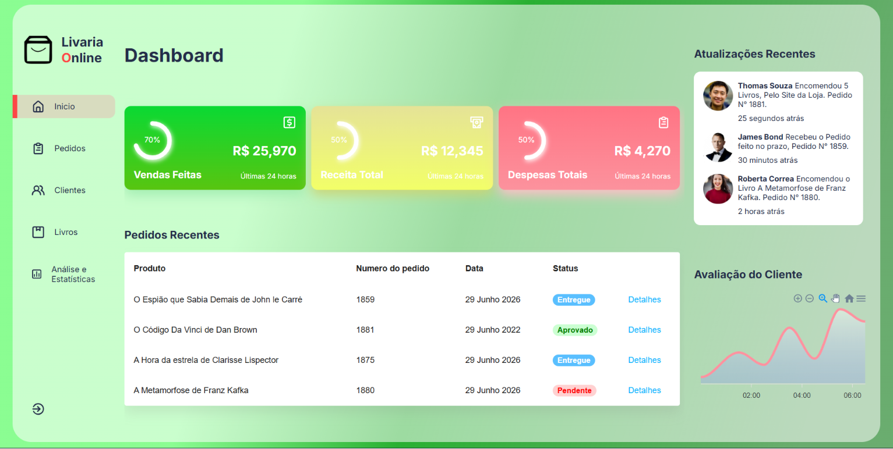
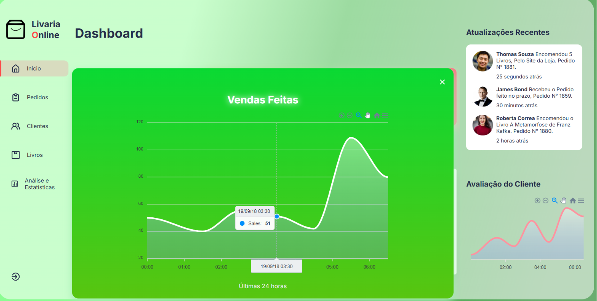
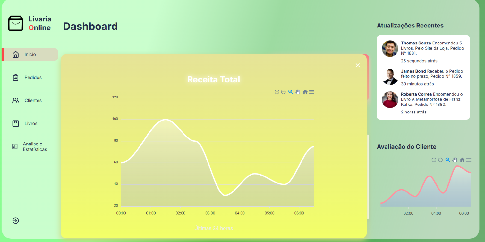
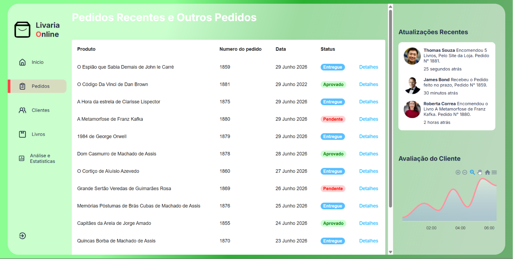
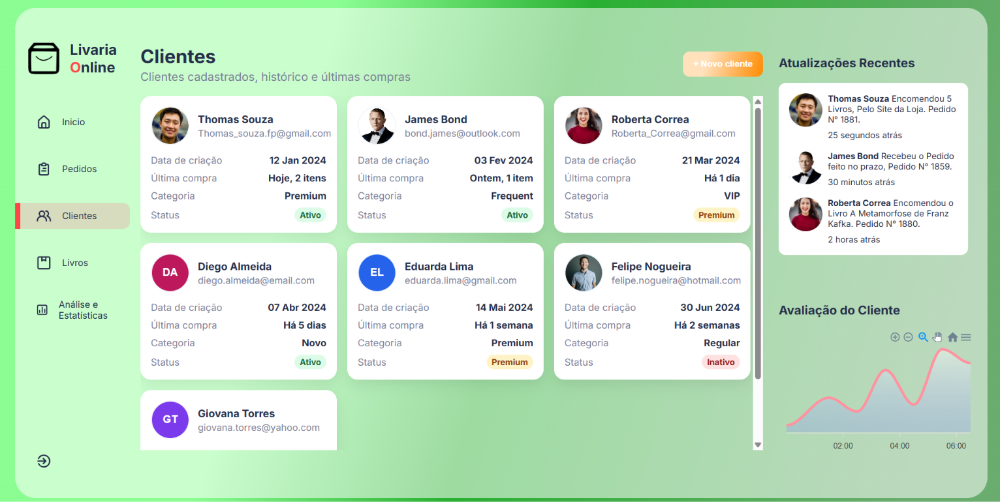
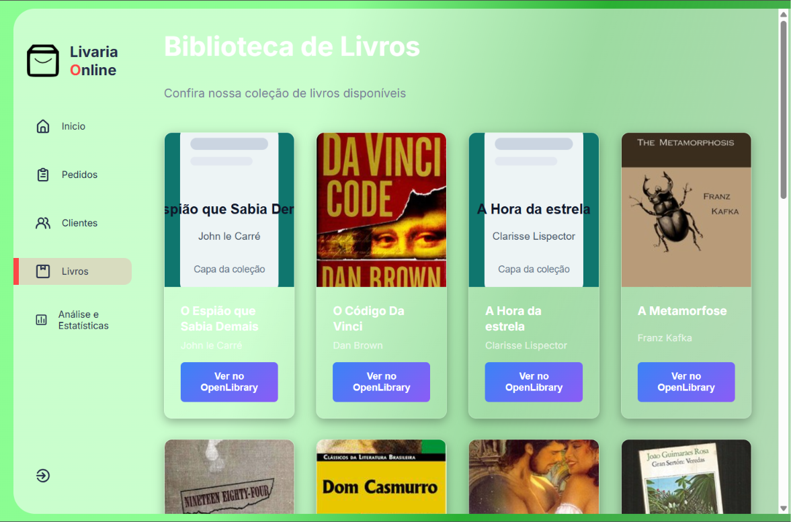
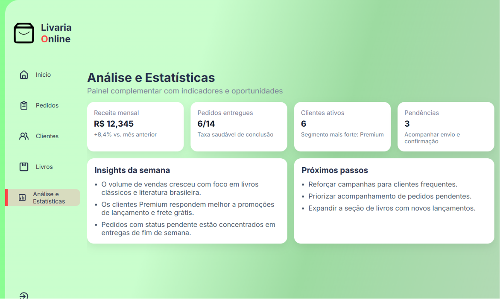

# 📚 Livaria Online - Painel Administrativo

Este é um projeto de estudo desenvolvido em **React** que simula o painel de gerenciamento (Dashboard) de uma livraria online. O objetivo principal é consolidar conhecimentos em componentização, gerenciamento de estado e construção de interfaces dinâmicas e responsivas.

---

## 🖥️ Telas do Sistema

O sistema conta com 5 visões principais projetadas para otimizar a experiência do administrador:

1. **Dashboard (Início):** Visão geral contendo os principais KPIs financeiros (Vendas Feitas, Receita Total, Despesas), feed de atualizações recentes de clientes, gráfico de avaliação de desempenho e uma listagem rápida dos pedidos mais recentes.
2. **Pedidos:** Uma tabela detalhada contendo todo o histórico de transações da livraria, permitindo acompanhar o status de cada entrega (*Entregue*, *Aprovado*, *Pendente*).
3. **Clientes:** Gerenciamento dos dados dos clientes cadastrados, exibindo e-mail, data de criação da conta, histórico de última compra, classificação de categoria (*Premium*, *Frequent*, *VIP*, *Regular*) e status de atividade.
4. **Biblioteca de Livros:** Vitrine virtual exibindo a coleção de livros disponíveis com capas integradas e direcionamento externo para consulta de metadados na API do *OpenLibrary*.
5. **Análise e Estatísticas:** Painel estratégico complementar com indicadores consolidados, insights automáticos da semana e sugestões de próximos passos para o negócio.

---

## 📸 Demonstração Visual (Prints)

As imagens das telas foram organizadas na pasta [Prints](Prints) para ilustrar cada parte do projeto:

* **Tela Inicial / Dashboard:**
  
  *Cards de métricas financeiras, atividades recentes e visão geral de pedidos, ao clicar nos cards abrira o dashboard respectivo com informações complementares de cada opção selecionada*

* **Dashboards dos Cards:**
  
  
  *Cada card tem seu dashboard, visualizando dados criados no arquivo, para base informativa e analitica.*
  

* **Gerenciamento de Pedidos:**
  
  *Página de pedidos com status, datas e detalhes.*

* **Controle de Clientes:**
  
  *Página de clientes com informações complementares e histórico.*

* **Biblioteca:**
  
  *Página de livros em formato de cards com links para visualização dos livros em sites*

* **Análises:**
  
  *Página de análise e estatísticas com indicadores e insights.*

---

## 🛠️ Tecnologias Utilizadas

* **React.js** - Biblioteca Javascript para construção da interface.
* **JavaScript (ES6+)** - Lógica de programação e manipulação de estados.
* **CSS3 / Styled Components** - Estilização moderna com paleta de cores em tons de verde pastel e componentes em formato de cartões (*glassmorphism/flat design*).
* **Yarn** - Gerenciador de pacotes confiável e rápido.

---

## 🚀 Como Executar o Projeto

Siga o passo a passo simples abaixo para clonar e rodar o projeto localmente em sua máquina.

### Pré-requisitos
Certifique-se de ter o **Git** e o **Node.js** (junto com o **Yarn**) instalados em seu computador.

### Passo a Passo

1. **Clone este repositório:**
   ```bash
   git clone [https://github.com/VitorRodrig15/React-dashboards](https://github.com/VitorRodrig15/React-dashboards)

2. Acesse a pasta do projeto, e instale as configurações adicionais no terminal:
    yarn

3. Inicie o servidor de desenvolvimento:
    yarn start

4. Acesse no seu navegador:
O projeto abrirá automaticamente na porta padrão. Caso contrário, acesse:

    👉 http://localhost:3000

Após isso pode utilizar normalmente e editar como quiser, para conhecer cada funcionamento e estudar sobre.

--- Desenvolvido como um projeto prático para fins de estudo e evolução técnica.

